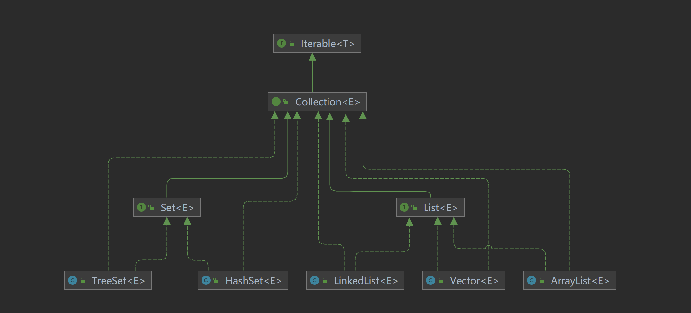
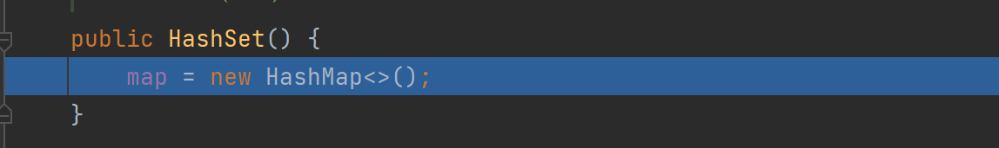
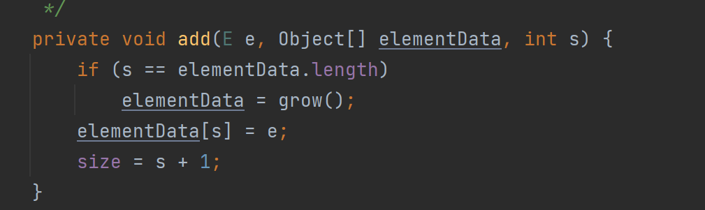
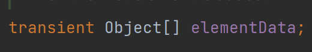
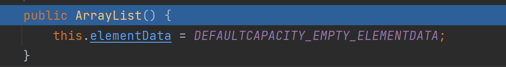
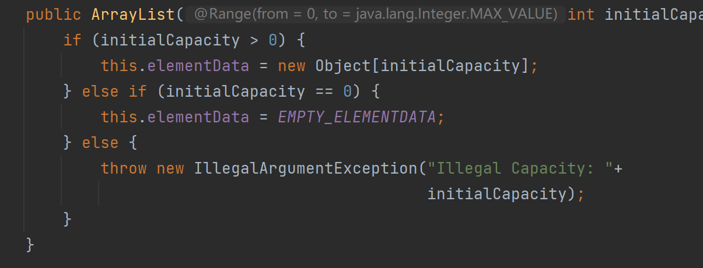

# Collection

整体框架

## Set

### TreeSet

### HashSet

**注意事项**

1. HashSet的底层是HashMap。
   
2. HashSet可以存放null值，但是只能有一个null值。
3. HashSet存储的元素不是有序的。

## List

### LinkedList

### Vector

### ArrayList

**注意事项**

1. ArrayList可以加入null元素。
2. ArrayList底层是数组实现的。
3. ArrayList是线程不安全的，可以看到源码中的方法是没有Sycnchronized关键字的。

**源码分析**

1. ArrayList中维护了一个Object类型的数组，elementData。transient关键字表示瞬间的、短暂的，表示该属性不会被序列化。
   
2. 创建ArrayList的两种方式
   
   一种是无参的构建方式，直接创建一个为空的数组，带一个int的构建方式会创建一个相应大小的数组。
3. 扩容方式
