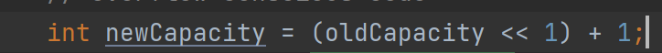

# Map

整体框架


**接口特点**

1. Map主要用于保存具有映射关系的数据：Key-Value
2. 

## HashMap

1. 底层是一个table数组，初始化大小是16.每一个元素都是HashMap内部定义的一个Node类，实现了Map.Entry接口。
2. 底层数据结构是 数组+链表+红黑树

**扩容机制**

1. HashMap底层维护一个Node类型的数组table，默认为null
2. 创建对象时，将加载因子（loadfactor）初始化为0.75，默认0.75的原因是：
4. 当添加Key-Value对象时，通过hashcode()方法得到Key的哈希值，然后得到在table下的索引值。先判断该索引处是否有元素，如果没有元素直接添加。如果该索引处有元素，判断Key是否相等，如果相等，则直接替换Value；如果不相等则判断是树结构还是链表结构，做出相应处理。如果添加时容量不够，则需要扩容。
5. 第一次添加时，table扩容容量为16，临界值(threshold)为12(16*0.75)
6. 以后再次扩容，则需要扩容table容量为原来的2倍(32)，临界值为原来的2倍，即24，依次类推
7. 如果一条链表的元素个数超过TREEIFY_THRESHOLD(8)，并且table的大小>=MIN_TREEIFY_CAPACITY(64)，就会进行树化(红黑树)

**源码**

```java
//put方法源代码
final V putVal(int hash, K key, V value, boolean onlyIfAbsent,
                   boolean evict) {
        Node<K,V>[] tab; Node<K,V> p; int n, i;
        if ((tab = table) == null || (n = tab.length) == 0) // 判断table是否为空，为空的话就进行创建，第一次大小为16
            n = (tab = resize()).length;
        if ((p = tab[i = (n - 1) & hash]) == null)		//判断当前这个节点是否为空，如果为空，就直接插入
            tab[i] = newNode(hash, key, value, null);
        else {
            Node<K,V> e; K k;
            if (p.hash == hash &&
                ((k = p.key) == key || (key != null && key.equals(k))))		//判断当前节点的是否key相等，如果是的话，那么直接将value覆盖
                e = p;
            else if (p instanceof TreeNode)					//判断当前节点是否红黑树结构，是的话，就按照树的操作方法处理
                e = ((TreeNode<K,V>)p).putTreeVal(this, tab, hash, key, value);
            else {
                for (int binCount = 0; ; ++binCount) {					//认为当前是一个链表结构，遍历链表，查询是否有相同key的节点
                    if ((e = p.next) == null) {
                        p.next = newNode(hash, key, value, null);
                        if (binCount >= TREEIFY_THRESHOLD - 1) // -1 for 1st
                            treeifyBin(tab, hash);
                        break;
                    }
                    if (e.hash == hash &&						//查询到有相同key的节点，break然后替换
                        ((k = e.key) == key || (key != null && key.equals(k))))
                        break;
                    p = e;
                }
            }
            if (e != null) { // existing mapping for key
                V oldValue = e.value;
                if (!onlyIfAbsent || oldValue == null)
                    e.value = value;
                afterNodeAccess(e);
                return oldValue;
            }
        }
        ++modCount;
        if (++size > threshold)				//每次插入操作后都要检验是否长度超过了最大限制，是的话，就要扩容。
            resize();
        afterNodeInsertion(evict);
        return null;
    }

//树化源代码
final void treeifyBin(Node<K,V>[] tab, int hash) {
    int n, index; Node<K,V> e;
    if (tab == null || (n = tab.length) < MIN_TREEIFY_CAPACITY)
        resize();
    else if ((e = tab[index = (n - 1) & hash]) != null) {
        TreeNode<K,V> hd = null, tl = null;
        do {
            TreeNode<K,V> p = replacementTreeNode(e, null);
            if (tl == null)
                hd = p;
            else {
                p.prev = tl;
                tl.next = p;
            }
            tl = p;
        } while ((e = e.next) != null);
        if ((tab[index] = hd) != null)
            hd.treeify(tab);
    }
}

```

**源码讲解**


初始化加载因子 LoadFactor = 0.75


put方法源码


hash()方法：如果是null值，直接返回0，所以只能只能有一个null值。如果不是null值，通过hashCode()方法获取key的哈希值，做一次16位右位移异或混合，获取hash值。


putVal赋值方法，第一次操作的时候，因为table为空，所以会调用到resize()方法


第一次给的table初始容量大小为16


在putVal方法中，当求得索引值当前空间为空时，直接赋值。


在putVal方法中，每一次操作之后，都会执行判断是否超过临界值，这里的threshold = 16 * 0.75 = 12，当超出时，就会进行扩容。

## TreeMap

## ConcurrentHashMap

采用的是synchronized和CAS的方法，与hashtable对整个列表上锁不同的是，ConcurrentHashMap是对每一个Node节点上锁，在实现了线程安全的同时提高了并发的效率

### CAS

悲观锁：当一个线程使用数据时，悲观锁总是认为其它线程也会过来修改这个数据。为了保证数据安全，其采用的是一种先加锁再访问的策略，其它线程要想也访问该数据则被阻塞等待、直到其获取到锁才可以访问。典型的，Java中的synchronized锁就是悲观锁

乐观锁：而对于乐观锁而言，其与悲观锁的思想则恰恰相反，其认为在使用数据的过程中其它线程不会修改这个数据，故不加锁直接访问。而当该线程需要提交更新、修改时，才会判断该数据在此期间有没有被其它线程更新、修改。如果其它线程确实没有修改，则该线程直接写入完成更新；反之如果该数据已经被其它线程更新、修改，则该线程将放弃本次数据的更新提交操作以避免出现冲突，并通过报错、重试等方式进行下一步处理。**CAS**算法就是乐观锁的一种典型实现

悲观锁适合写操作多的场景，而乐观锁则更适合读操作多的场景

**CAS算法原理描述**：

* 在对变量进行计算之前(如 ++ 操作)，首先读取原变量值，称为 **旧的预期值 A**
* 然后在更新之前再获取当前内存中的值，称为 **当前内存值 V**
* 如果 A==V 则说明变量从未被其他线程修改过，此时将会写入**新值 B**
* 如果 A!=V 则说明变量已经被其他线程修改过，当前线程应当什么也不做。

## Hashtable

1. 存放的是键值对数据，即：K-V
2. Hashtable的键和值都不能为null
3. Hashtable是线程安全的，有synchronized关键字
   
4. Hashtable底层是数组。结构为Entry，初始大小为11，临界值为0.75 * 11 = 8
   
5. 扩容是扩大两倍再加1，11->23 临界值为 23 * 0.75 = 17
   
