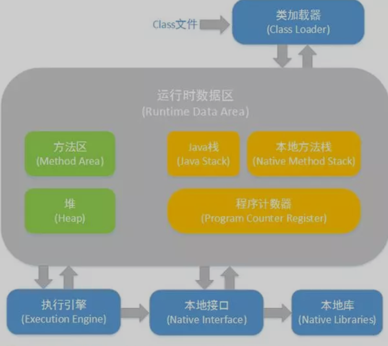
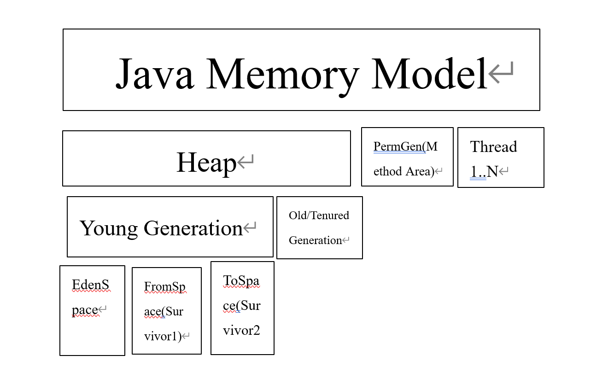

# JVM的结构

## 类加载器

### **类的加载**

类的加载指的是将类的.class文件中的二进制数据读入到内存中，将其放在运行时数据区的方法区内，然后在堆区创建一个java.lang.class对象，用来封装类在方法区内的数据结构。类的加载的最终产品是位于堆区中的Class对象封装了类在方法区内的数据结构，并且向Java程序员提供了访问方法区内的数据结构的接口。

### 类的生命周期

类加载的过程包括了加载、验证、准备、解析、初始化五个阶段。在这五个阶段中，加载、验证、准备和初始化这四个阶段发生的顺序是确定的，而解析阶段则不一定，它在某些情况下可以在初始化阶段之后开始，这是为了支持Java语言的运行时绑定（也成为动态绑定或晚期绑定）。另外注意这里的几个阶段是按顺序开始，而不是按顺序进行或完成，因为这些阶段通常都是互相交叉地混合进行的，通常在一个阶段执行的过程中调用或激活另一个阶段。在加载过程之后还有使用和卸载。

#### 加载

查找并加载类的二进制数据加载时类加载过程的第一个阶段，在加载阶段，虚拟机需要完成以下三件事情：

* 通过一个类的全限定名来获取其定义的二进制字节流。
* 将这个字节流所代表的静态存储结构转化为方法区的运行时数据结构。
* 在Java堆中生成一个代表这个类的java.lang.class对象，作为对方法区中这些数据的访问入口。

开发人员既可以使用系统提供的类加载器来完成加载，也可以自定义自己的类加载器来完成加载。加载阶段完成后，虚拟机外部的二进制字节流就按照虚拟机所需的格式存储在方法区之中，而且在Java堆中也创建一个java.lang.class类的对象，这样便可以通过该对象访问方法区中的这些数据。

#### 连接

##### 验证

验证是连接阶段的第一步，这一阶段的目的是为了确保Class文件的字节流中包含的信息符合当前虚拟机的要求，并且不会危害虚拟机自身的安全。验证阶段大致会完成4个阶段的检验动作：

* **文件格式验证** ：验证字节流是否符合Class文件格式的规范；例如：主次版本号是否在当前虚拟机的处理范围之内、常量池中的常量是否有不被支持的类型。
* **元数据验证** ：对字节码描述的信息进行语义分析（注意：对比javac编译阶段的语义分析），以保证其描述的信息符合Java语言规范的要求；例如：这个类是否有父类，除了Object之外。
* **字节码验证** ：通过数据流和控制流分析，确定程序语义是合法的、符合逻辑的。
* **符号引用验证** ：确保解析动作能正确执行。
  验证阶段是非常重要的，但不是必须的，它对程序运行期没有影响，如果所引用的类经过反复验证，那么可以考虑采用-Xverifynone参数来关闭大部分的类验证措施，以缩短虚拟机类加载的时间。

##### **准备**

准备阶段是正式为类变量分配内存并设置类变量初始值的阶段，这些内存都将在方法区中分配。对于该阶段有以下几点需要注意：

* 1、这时候进行内存分配的仅包括类变量（static），而不包括实例变量，实例变量会在对象实例化时随着对象一块分配在Java堆中。
* 2、这里所设置的初始值通常情况下是数据类型默认的零值（如0、0L、null、false等），而不是被在Java代码中被显式地赋予的值。

## 内存结构

JVM内存结构主要有三大块： **堆内存** 、**方法区**和 **栈** 。堆内存是JVM中最大的一块由年轻代和老年代组成，而年轻代内存又被分成三部分， **Eden空间** 、 **From Survivor空间** 、 **To Survivor空间** ,默认情况下年轻代按照**8:1:1**的比例来分配

方法区存储类信息、常量、静态变量等数据，是线程共享的区域，为与Java堆区分，方法区还有一个别名Non-Heap(非堆)；栈又分为java虚拟机栈和本地方法栈主要用于方法的执行。

### Java堆(Heap)

对于大多数应用来说，Java堆（Java Heap）是Java虚拟机所管理的内存中**最大**的一块。Java堆是被所有线程共享的一块内存区域，在虚拟机启动时创建。此内存区域的唯一目的就是存放对象实例， **几乎所有的对象实例都在这里分配内存** 。

Java堆是垃圾收集器管理的主要区域，因此很多时候也被称做“ **GC堆** ”。如果从内存回收的角度看，由于现在收集器基本都是采用的分代收集算法，所以Java堆中还可以细分为：**新生代(Young Generation)和老年代(Old Generation)；再细致一点的有Eden空间、From Survivor空间、To Survivor空间等。**

如果在堆中没有内存完成实例分配，并且堆也无法再扩展时，将会抛出OutOfMemoryError异常。

### 方法区（Method Area）

方法区（Method Area）与Java堆一样，是各个线程共享的内存区域，**它用于存储已被虚拟机加载的类信息、常量、静态变量、即时编译器编译后的代码等数据。**

所有的对象在实例化后的整个运行周期内，都被存放在堆内存中。堆内存又被划分成不同的部分：伊甸区(Eden)，幸存者区域(Survivor Sapce)，老年代（Old Generation Space）。

方法的执行都是伴随着线程的。原始类型的本地变量以及引用都存放在线程栈中。而引用关联的对象比如String，都存在在堆中。

### 程序计数器（Program Counter Register）

程序计数器（Program Counter Register）是一块较小的内存空间，它的作用可以看做是当前线程所执行的字节码的行号指示器。在虚拟机的概念模型里（仅是概念模型，各种虚拟机可能会通过一些更高效的方式去实现），字节码解释器工作时就是通过改变这个计数器的值来选取下一条需要执行的字节码指令，分支、循环、跳转、异常处理、线程恢复等基础功能都需要依赖这个计数器来完成。

由于Java虚拟机的多线程是通过线程轮流切换并分配处理器执行时间的方式来实现的，在任何一个确定的时刻，一个处理器（对于多核处理器来说是一个内核）只会执行一条线程中的指令。因此，为了线程切换后能恢复到正确的执行位置，每条线程都需要有一个独立的程序计数器，各条线程之间的计数器互不影响，独立存储，我们称这类内存区域为“线程私有”的内存。

如果线程正在执行的是一个Java方法，这个计数器记录的是正在执行的虚拟机字节码指令的地址；如果正在执行的是Natvie方法，这个计数器值则为空（Undefined）。

**此内存区域是唯一一个在Java虚拟机规范中没有规定任何OutOfMemoryError情况的区域。**

### JVM栈（JVM Stacks）

与程序计数器一样，Java虚拟机栈（Java Virtual Machine Stacks）也是线程私有的， **它的生命周期与线程相同。虚拟机栈描述的是Java方法执行的内存模型：** 每个方法被执行的时候都会同时创建一个栈帧（Stack Frame）用于存储局部变量表、操作栈、动态链接、方法出口等信息。**每一个方法被调用直至执行完成的过程，就对应着一个栈帧在虚拟机栈中从入栈到出栈的过程。**

局部变量表存放了编译期可知的各种基本数据类型（boolean、byte、char、short、int、float、long、double）、对象引用（reference类型，它不等同于对象本身，根据不同的虚拟机实现，它可能是一个指向对象起始地址的引用指针，也可能指向一个代表对象的句柄或者其他与此对象相关的位置）和returnAddress类型（指向了一条字节码指令的地址）。

其中64位长度的long和double类型的数据会占用2个局部变量空间（Slot），其余的数据类型只占用1个。局部变量表所需的内存空间在编译期间完成分配，当进入一个方法时，这个方法需要在帧中分配多大的局部变量空间是完全确定的，在方法运行期间不会改变局部变量表的大小。

在Java虚拟机规范中，对这个区域规定了两种异常状况：如果线程请求的栈深度大于虚拟机所允许的深度，将抛出StackOverflowError异常；如果虚拟机栈可以动态扩展（当前大部分的Java虚拟机都可动态扩展，只不过Java虚拟机规范中也允许固定长度的虚拟机栈），当扩展时无法申请到足够的内存时会抛出OutOfMemoryError异常。

# GC垃圾收集器
