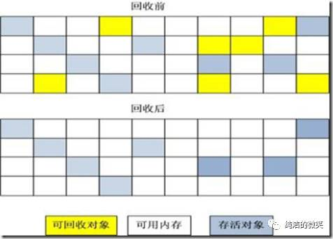
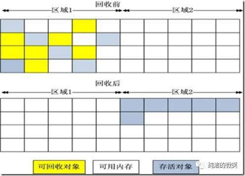
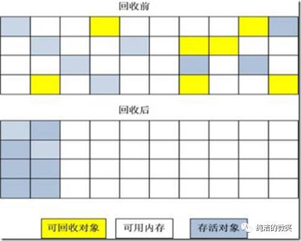
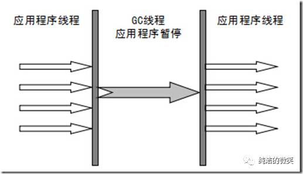
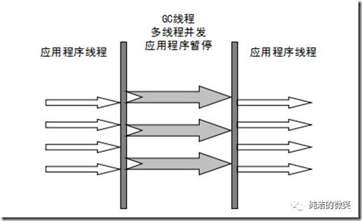

# JVM的结构

## 类加载器

### **类的加载**

类的加载指的是将类的.class文件中的二进制数据读入到内存中，将其放在运行时数据区的方法区内，然后在堆区创建一个java.lang.class对象，用来封装类在方法区内的数据结构。类的加载的最终产品是位于堆区中的Class对象封装了类在方法区内的数据结构，并且向Java程序员提供了访问方法区内的数据结构的接口。

### 类的生命周期

类加载的过程包括了加载、验证、准备、解析、初始化五个阶段。在这五个阶段中，加载、验证、准备和初始化这四个阶段发生的顺序是确定的，而解析阶段则不一定，它在某些情况下可以在初始化阶段之后开始，这是为了支持Java语言的运行时绑定（也成为动态绑定或晚期绑定）。另外注意这里的几个阶段是按顺序开始，而不是按顺序进行或完成，因为这些阶段通常都是互相交叉地混合进行的，通常在一个阶段执行的过程中调用或激活另一个阶段。在加载过程之后还有使用和卸载。

#### 加载

查找并加载类的二进制数据加载时类加载过程的第一个阶段，在加载阶段，虚拟机需要完成以下三件事情：

* 通过一个类的全限定名来获取其定义的二进制字节流。
* 将这个字节流所代表的静态存储结构转化为方法区的运行时数据结构。
* 在Java堆中生成一个代表这个类的java.lang.class对象，作为对方法区中这些数据的访问入口。

开发人员既可以使用系统提供的类加载器来完成加载，也可以自定义自己的类加载器来完成加载。加载阶段完成后，虚拟机外部的二进制字节流就按照虚拟机所需的格式存储在方法区之中，而且在Java堆中也创建一个java.lang.class类的对象，这样便可以通过该对象访问方法区中的这些数据。

#### 连接

##### 验证

验证是连接阶段的第一步，这一阶段的目的是为了确保Class文件的字节流中包含的信息符合当前虚拟机的要求，并且不会危害虚拟机自身的安全。验证阶段大致会完成4个阶段的检验动作：

* **文件格式验证** ：验证字节流是否符合Class文件格式的规范；例如：主次版本号是否在当前虚拟机的处理范围之内、常量池中的常量是否有不被支持的类型。
* **元数据验证** ：对字节码描述的信息进行语义分析（注意：对比javac编译阶段的语义分析），以保证其描述的信息符合Java语言规范的要求；例如：这个类是否有父类，除了Object之外。
* **字节码验证** ：通过数据流和控制流分析，确定程序语义是合法的、符合逻辑的。
* **符号引用验证** ：确保解析动作能正确执行。
  验证阶段是非常重要的，但不是必须的，它对程序运行期没有影响，如果所引用的类经过反复验证，那么可以考虑采用-Xverifynone参数来关闭大部分的类验证措施，以缩短虚拟机类加载的时间。

##### **准备**

准备阶段是正式为类变量分配内存并设置类变量初始值的阶段，这些内存都将在方法区中分配。对于该阶段有以下几点需要注意：

* 1、这时候进行内存分配的仅包括类变量（static），而不包括实例变量，实例变量会在对象实例化时随着对象一块分配在Java堆中。
* 2、这里所设置的初始值通常情况下是数据类型默认的零值（如0、0L、null、false等），而不是被在Java代码中被显式地赋予的值。

## 内存结构

JVM内存结构主要有三大块： **堆内存** 、**方法区**和 **栈** 。堆内存是JVM中最大的一块由年轻代和老年代组成，而年轻代内存又被分成三部分， **Eden空间** 、 **From Survivor空间** 、 **To Survivor空间** ,默认情况下年轻代按照**8:1:1**的比例来分配

方法区存储类信息、常量、静态变量等数据，是线程共享的区域，为与Java堆区分，方法区还有一个别名Non-Heap(非堆)；栈又分为java虚拟机栈和本地方法栈主要用于方法的执行。

### Java堆(Heap)

对于大多数应用来说，Java堆（Java Heap）是Java虚拟机所管理的内存中**最大**的一块。Java堆是被所有线程共享的一块内存区域，在虚拟机启动时创建。此内存区域的唯一目的就是存放对象实例， **几乎所有的对象实例都在这里分配内存** 。

Java堆是垃圾收集器管理的主要区域，因此很多时候也被称做“ **GC堆** ”。如果从内存回收的角度看，由于现在收集器基本都是采用的分代收集算法，所以Java堆中还可以细分为：**新生代(Young Generation)和老年代(Old Generation)；再细致一点的有Eden空间、From Survivor空间、To Survivor空间等。**

如果在堆中没有内存完成实例分配，并且堆也无法再扩展时，将会抛出OutOfMemoryError异常。

### 方法区（Method Area）

方法区（Method Area）与Java堆一样，是各个线程共享的内存区域，**它用于存储已被虚拟机加载的类信息、常量、静态变量、即时编译器编译后的代码等数据。**

所有的对象在实例化后的整个运行周期内，都被存放在堆内存中。堆内存又被划分成不同的部分：伊甸区(Eden)，幸存者区域(Survivor Sapce)，老年代（Old Generation Space）。

方法的执行都是伴随着线程的。原始类型的本地变量以及引用都存放在线程栈中。而引用关联的对象比如String，都存在在堆中。

### 程序计数器（Program Counter Register）

程序计数器（Program Counter Register）是一块较小的内存空间，它的作用可以看做是当前线程所执行的字节码的行号指示器。在虚拟机的概念模型里（仅是概念模型，各种虚拟机可能会通过一些更高效的方式去实现），字节码解释器工作时就是通过改变这个计数器的值来选取下一条需要执行的字节码指令，分支、循环、跳转、异常处理、线程恢复等基础功能都需要依赖这个计数器来完成。

由于Java虚拟机的多线程是通过线程轮流切换并分配处理器执行时间的方式来实现的，在任何一个确定的时刻，一个处理器（对于多核处理器来说是一个内核）只会执行一条线程中的指令。因此，为了线程切换后能恢复到正确的执行位置，每条线程都需要有一个独立的程序计数器，各条线程之间的计数器互不影响，独立存储，我们称这类内存区域为“线程私有”的内存。

如果线程正在执行的是一个Java方法，这个计数器记录的是正在执行的虚拟机字节码指令的地址；如果正在执行的是Natvie方法，这个计数器值则为空（Undefined）。

**此内存区域是唯一一个在Java虚拟机规范中没有规定任何OutOfMemoryError情况的区域。**

### JVM栈（JVM Stacks）

与程序计数器一样，Java虚拟机栈（Java Virtual Machine Stacks）也是线程私有的， **它的生命周期与线程相同。虚拟机栈描述的是Java方法执行的内存模型：** 每个方法被执行的时候都会同时创建一个栈帧（Stack Frame）用于存储局部变量表、操作栈、动态链接、方法出口等信息。**每一个方法被调用直至执行完成的过程，就对应着一个栈帧在虚拟机栈中从入栈到出栈的过程。**

局部变量表存放了编译期可知的各种基本数据类型（boolean、byte、char、short、int、float、long、double）、对象引用（reference类型，它不等同于对象本身，根据不同的虚拟机实现，它可能是一个指向对象起始地址的引用指针，也可能指向一个代表对象的句柄或者其他与此对象相关的位置）和returnAddress类型（指向了一条字节码指令的地址）。

其中64位长度的long和double类型的数据会占用2个局部变量空间（Slot），其余的数据类型只占用1个。局部变量表所需的内存空间在编译期间完成分配，当进入一个方法时，这个方法需要在帧中分配多大的局部变量空间是完全确定的，在方法运行期间不会改变局部变量表的大小。

在Java虚拟机规范中，对这个区域规定了两种异常状况：如果线程请求的栈深度大于虚拟机所允许的深度，将抛出StackOverflowError异常；如果虚拟机栈可以动态扩展（当前大部分的Java虚拟机都可动态扩展，只不过Java虚拟机规范中也允许固定长度的虚拟机栈），当扩展时无法申请到足够的内存时会抛出OutOfMemoryError异常。

# GC垃圾收集器

垃圾收集 Garbage Collection 通常被称为“GC”。

## 对象存活判断

判断对象是否存活一般有两种方式：

 **引用计数** ：每个对象有一个引用计数属性，新增一个引用时计数加1，引用释放时计数减1，计数为0时可以回收。此方法简单，无法解决对象相互循环引用的问题。
 **可达性分析** （Reachability Analysis）：从GC Roots开始向下搜索，搜索所走过的路径称为引用链。当一个对象到GC Roots没有任何引用链相连时，则证明此对象是不可用的。不可达对象。

在Java语言中，GC Roots包括：

* 虚拟机栈中引用的对象。
* 方法区中类静态属性实体引用的对象。
* 方法区中常量引用的对象。
* 本地方法栈中JNI引用的对象。

## 垃圾收集算法

### 标记 -清除算法

“标记-清除”（Mark-Sweep）算法，如它的名字一样，算法分为“标记”和“清除”两个阶段：首先标记出所有需要回收的对象，在标记完成后统一回收掉所有被标记的对象。之所以说它是最基础的收集算法，是因为后续的收集算法都是基于这种思路并对其缺点进行改进而得到的。

它的主要缺点有两个：一个是效率问题，标记和清除过程的效率都不高；另外一个是空间问题，标记清除之后会产生大量不连续的内存碎片，空间碎片太多可能会导致，当程序在以后的运行过程中需要分配较大对象时无法找到足够的连续内存而不得不提前触发另一次垃圾收集动作。

### 复制算法

“复制”（Copying）的收集算法，它将可用内存按容量划分为大小相等的两块，每次只使用其中的一块。当这一块的内存用完了，就将还存活着的对象复制到另外一块上面，然后再把已使用过的内存空间一次清理掉。

这样使得每次都是对其中的一块进行内存回收，内存分配时也就不用考虑内存碎片等复杂情况，只要移动堆顶指针，按顺序分配内存即可，实现简单，运行高效。只是这种算法的代价是将内存缩小为原来的一半，持续复制长生存期的对象则导致效率降低。

### 标记-压缩算法

复制收集算法在对象存活率较高时就要执行较多的复制操作，效率将会变低。更关键的是，如果不想浪费50%的空间，就需要有额外的空间进行分配担保，以应对被使用的内存中所有对象都100%存活的极端情况，所以在老年代一般不能直接选用这种算法。

根据老年代的特点，有人提出了另外一种“标记-整理”（Mark-Compact）算法，标记过程仍然与“标记-清除”算法一样，但后续步骤不是直接对可回收对象进行清理，而是让所有存活的对象都向一端移动，然后直接清理掉端边界以外的内存

### 分代收集算法

GC分代的基本假设：绝大部分对象的生命周期都非常短暂，存活时间短。

“分代收集”（Generational Collection）算法，把Java堆分为新生代和老年代，这样就可以根据各个年代的特点采用最适当的收集算法。在新生代中，每次垃圾收集时都发现有大批对象死去，只有少量存活，那就选用复制算法，只需要付出少量存活对象的复制成本就可以完成收集。而老年代中因为对象存活率高、没有额外空间对它进行分配担保，就必须使用“标记-清理”或“标记-整理”算法来进行回收。

## 垃圾收集器

> 如果说收集算法是内存回收的方法论，垃圾收集器就是内存回收的具体实现

### Serial收集器

串行收集器是最古老，最稳定以及效率高的收集器，可能会产生较长的停顿，只使用一个线程去回收。新生代、老年代使用串行回收；新生代复制算法、老年代标记-压缩；垃圾收集的过程中会Stop The World（服务暂停）

### ParNew收集器

ParNew收集器其实就是Serial收集器的多线程版本。新生代并行，老年代串行；新生代复制算法、老年代标记-压缩

### Parallel收集器

Parallel Scavenge收集器类似ParNew收集器，Parallel收集器更关注系统的吞吐量。可以通过参数来打开自适应调节策略，虚拟机会根据当前系统的运行情况收集性能监控信息，动态调整这些参数以提供最合适的停顿时间或最大的吞吐量；也可以通过参数控制GC的时间不大于多少毫秒或者比例；新生代复制算法、老年代标记-压缩

### Parallel Old 收集器

Parallel Old是Parallel Scavenge收集器的老年代版本，使用多线程和“标记－整理”算法。这个收集器是在JDK 1.6中才开始提供
