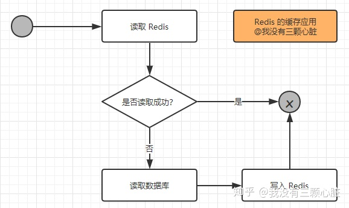
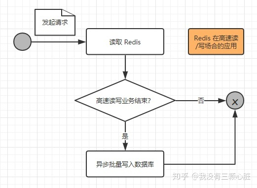

# Redis概述

在我们日常的Java Web开发中，无不都是使用数据库来进行数据的存储，由于一般的系统任务中通常不会存在高并发的情况，所以这样看起来并没有什么问题，可是一旦涉及大数据量的需求，比如一些商品抢购的情景，或者是主页访问量瞬间较大的时候，单一使用数据库来保存数据的系统会因为面向磁盘，磁盘读/写速度比较慢的问题而存在严重的性能弊端，一瞬间成千上万的请求到来，需要系统在极短的时间内完成成千上万次的读/写操作，这个时候往往不是数据库能够承受的，极其容易造成数据库系统瘫痪，最终导致服务宕机的严重生产问题。

# NoSql

为了克服上述的问题，Java Web项目通常会引入NoSQL技术，这是一种 **基于内存的数据库** ，并且提供一定的持久化功能。

**Redis**和**MongoDB**是当前使用最广泛的NoSQL，而就Redis技术而言，它的性能十分优越，可以 **支持每秒十几万此的读/写操作** ，其性能远超数据库，并且还**支持集群、分布式、主从同步等**配置，原则上可以无限扩展，让更多的数据存储在内存中，更让人欣慰的是它还 **支持一定的事务能力** ，这保证了高并发的场景下数据的安全和一致性。

# Redis 在 Java Web 中的应用

Redis 在 Java Web 主要有两个应用场景：

* 存储 **缓存** 用的数据；
* 需要高速读/写的场合 **使用它快速读/写** ；

## 缓存

在日常对数据库的访问中，读操作的次数远超写操作，比例大概在 **1:9** 到  **3:7** ，所以需要读的可能性是比写的可能大得多的。当我们使用SQL语句去数据库进行读写操作时，数据库就会 **去磁盘把对应的数据索引取回来** ，这是一个相对较慢的过程。

如果我们把数据放在 Redis 中，也就是直接放在内存之中，让服务端 **直接去读取内存中的数据** ，那么这样速度明显就会快上不少，并且会极大减小数据库的压力，但是使用内存进行数据存储开销也是比较大的，限于成本的原因，一般我们 **只是使用 Redis 存储一些常用和主要的数据** ，比如用户登录的信息等。

一般而言在使用 Redis 进行存储的时候，我们需要从以下几个方面来考虑：

* 业务数据常用吗？命中率如何？如果命中率很低，就没有必要写入缓存；
* 该业务数据是读操作多，还是写操作多？如果写操作多，频繁需要写入数据库，也没有必要使用缓存；
* 业务数据大小如何？如果要存储几百兆字节的文件，会给缓存带来很大的压力，这样也没有必要；

在考虑了这些问题之后，如果觉得有必要使用缓存，那么就使用它！使用 Redis 作为缓存的读取逻辑如下图所示：




从上图我们可以知道以下两点：

1. 当 **第一次读取数据的时候** ，读取 Redis 的数据就会失败，此时就会触发程序读取数据库，把数据读取出来，并且写入 Redis 中；
2. 当 **第二次以及以后需要读取数据时** ，就会直接读取 Redis，读到数据后就结束了流程，这样速度就大大提高了。

从上面的分析可以知道，读操作的可能性是远大于写操作的，所以使用 Redis 来处理日常中需要经常读取的数据，速度提升是显而易见的，同时也降低了对数据库的依赖，使得数据库的压力大大减少。

## 高速读/写的场合

在如今的互联网中，越来越多的存在高并发的情况，比如天猫双11、抢红包、抢演唱会门票等，这些场合都是在某一个瞬间或者是某一个短暂的时刻有**成千上万的请求**到达服务器，如果单纯的使用数据库来进行处理，就算不崩，也会很慢的， **轻则造成用户体验极差用户量流失** ， **重则数据库瘫痪，服务宕机** ，而这样的场合都是不允许的！

所以我们需要使用 Redis 来应对这样的高并发需求的场合，我们先来看看 **一次请求操作的流程图** ：




1. 当一个请求到达服务器时，只是把业务数据在 Redis 上进行读写，而没有对数据库进行任何的操作，这样就能大大提高读写的速度，从而满足 **高速响应的需求** ；
2. 但是这些缓存的数据仍然需要持久化，也就是存入数据库之中，所以在一个请求操作完 Redis 的读/写之后，会去 **判断该高速读/写的业务是否结束** ，这个判断通常会在秒杀商品为0，红包金额为0时成立，如果不成立，则不会操作数据库；如果成立，则触发事件将 Redis 的缓存的数据以批量的形式 **一次性写入数据库** ，从而完成持久化的工作。


# Redis命令

输入redis-server.exe redis.windows.conf，再在另一个命令行redis-cli.exe -h 127.0.0.1 -p 6379就可以启动redis服务

# Spring Data Redis

## 导入依赖

```xml
        <dependency>
            <groupId>org.springframework.boot</groupId>
            <artifactId>spring-boot-starter-data-redis</artifactId>
            <exclusions>
                <exclusion>
                    <groupId>io.lettuce</groupId>
                    <artifactId>lettuce-core</artifactId>
                </exclusion>
            </exclusions>
        </dependency>

        <dependency>
            <groupId>redis.clients</groupId>
            <artifactId>jedis</artifactId>
        </dependency>
```
