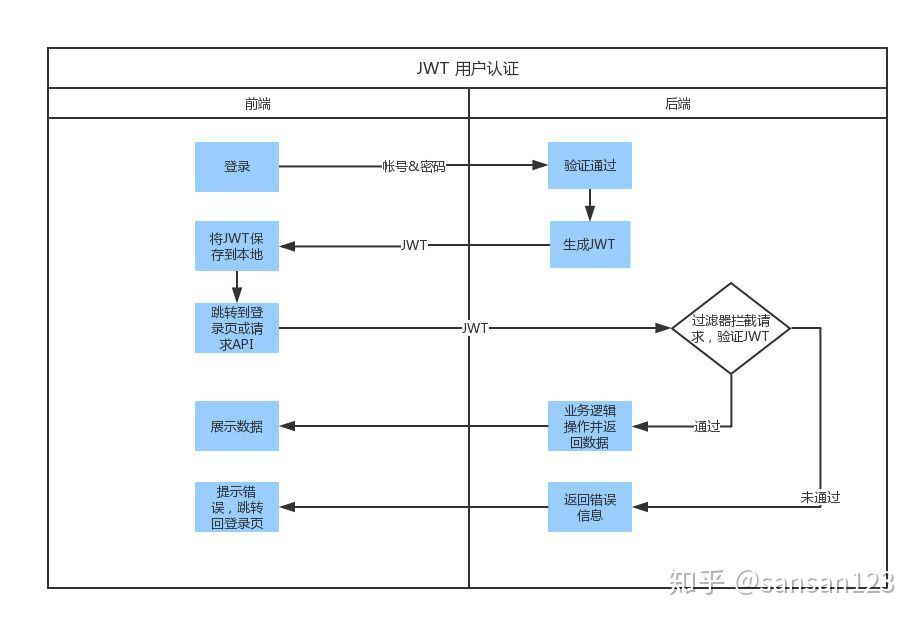

# JWT定义

JSON Web Token (JWT)是一个开放标准(RFC 7519)，它定义了一种紧凑的、自包含的方式，用于作为JSON对象在各方之间安全地传输信息。该信息可以被验证和信任，因为它是数字签名的。

# 使用场景

* Authorization (授权) : 这是使用JWT的最常见场景。一旦用户登录，后续每个请求都将包含JWT，允许用户访问该令牌允许的路由、服务和资源。单点登录是现在广泛使用的JWT的一个特性，因为它的开销很小，并且可以轻松地跨域使用。

* Information Exchange (信息交换) : 对于安全的在各方之间传输信息而言，JSON Web Tokens无疑是一种很好的方式。因为JWT可以被签名，例如，用公钥/私钥对，你可以确定发送人就是它们所说的那个人。另外，由于签名是使用头和有效负载计算的，您还可以验证内容没有被篡改。

# JWT结构

## JSON Web Token由三部分组成，它们之间用圆点(.)连接。这三部分分别是：

* Header
* Payload
* Signature

## Header

header由两部分组成：token类型（JWT）和算法名称（HMAC、RSA）

例如：

```json
{

    ‘alg':"RSA",

    'typ':"JWT"

}
```

然后，用Base64对这个JSON编码得到JWT的第一部分

## Payload

它包含声明（要求）。声明是关于实体(通常是用户)和其他数据的声明。声明有三种类型: registered, public 和 private。

* Registered claims : 这里有一组预定义的声明，它们不是强制的，但是推荐。比如：iss (issuer), exp (expiration time), sub (subject), aud (audience)等。
* Public claims : 可以随意定义。
* Private claims : 用于在同意使用它们的各方之间共享信息，并且不是注册的或公开的声明。

## Signature

为了得到签名部分，你必须有编码过的header、编码过的payload、一个秘钥，签名算法是header中指定的那个，然对它们签名即可。

# JWT如何工作

在认证的时候，当用户用他们的凭证成功登录以后，一个JSON Web Token将会被返回。此后，token就是用户凭证了，你必须非常小心以防止出现安全问题。一般而言，你保存令牌的时候不应该超过你所需要它的时间。

无论何时用户想要访问受保护的路由或者资源的时候，用户代理（通常是浏览器）都应该带上JWT，典型的，通常放在Authorization header中，用Bearer schema。

每一次请求都需要token -Token应该放在请求header中 -我们还需要将服务器设置为接受来自所有域的请求



```java
public class JwtUtil {

    private static final long EXPIRE = 60*60*1000; //设置过期时间

    public static final SecretKey key = Keys.secretKeyFor(SignatureAlgorithm.HS256); //算法动态生成的密钥

    /**
     *生成加密后的token
     *
     *
     * @param subject 需要加密的信息
     * @return  加密之后的密钥
     */


    public static String createJWT(String subject){

        Date nowDate = new Date();
        Date expDate = new Date(System.currentTimeMillis() + EXPIRE);

        return  Jwts.builder()
                .setIssuer("YX")    //发送方
                .setSubject(subject)    //加密信息
                .setExpiration(expDate) //过期时间
                .setIssuedAt(nowDate) // 现在的时间
                .signWith(key)      //算法key
                .compact();
    }

    /**
     *
     * @param jwt 加密之后的密钥
     * @return 原始的信息
     */
    public static String getClaim(String jwt){
        return Jwts.parserBuilder().setSigningKey(key).build().parseClaimsJws(jwt).getBody().getSubject();
    }

    public static void main(String[] args) {

        String jwt = createJWT("YX");
        String claim = getClaim(jwt);


    }
}
```
