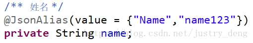

# Bean

# 注解

## @RequestBody

@RequestBody主要用来接收前端传递给后端的json字符串中的数据的(请求体中的数据的)；而最常用的使用请求体传参的无疑是POST请求了，所以使用@RequestBody接收数据时，一般都用POST方式进行提交。

根据不同的Content-Type等情况,Spring-MVC会采取不同的HttpMessageConverter实现来进行信息转换解析。下面介绍的是最常用的：前端以Content-Type 为application/json,传递json字符串数据;后端以@RequestBody模型接收数据的情况

解析json数据大体流程概述：
        Http传递请求体信息，最终会被封装进com.fasterxml.jackson.core.json.UTF8StreamJsonParser中(提示：Spring采用CharacterEncodingFilter设置了默认编码为UTF-8)，然后在public class BeanDeserializer extends BeanDeserializerBase implements java.io.Serializable中，通过 public Object deserializeFromObject(JsonParser p, DeserializationContext ctxt) throws IOException方法进行解析。

1. @JsonAlias注解，实现:json转模型时，使json中的特定key能转化为特定的模型属性;但是模型转json时，
   对应的转换后的key仍然与属性名一致，见：上图示例中的name字段的请求与响应。此时，json字符串转换为模型时，json中key为Name或为name123或为name的都能识别。
   
2. @JsonProperty注解，实现：json转模型时，使json中的特定key能转化为指定的模型属性；同样的，模型转json时，对应的转换后的key为指定的key，见：示例中的motto字段的请求与响应此时，json字符串转换为模型时，key为MOTTO的能识别，但key为motto的不能识别。
3. @JsonAlias注解需要依赖于setter、getter，而@JsonProperty注解不需要。
4. 在不考虑上述两个注解的一般情况下，key与属性匹配时,**默认大小写敏感**。
5. 有多个相同的key的json字符串中，转换为模型时，会以相同的几个key中，排在最后的那个key的值给模型属性复制，因为setter会覆盖原来的值。
6. 后端@RequestBody注解对应的类在将HTTP的输入流(含请求体)装配到目标类(即:@RequestBody后面的类)时，会根据json字符串中的key来匹配对应实体类的属性，如果匹配一致且json中的该key对应的值符合(或可转换为)实体类的对应属性的类型要求时，会调用实体类的setter方法将值赋给该属性。
