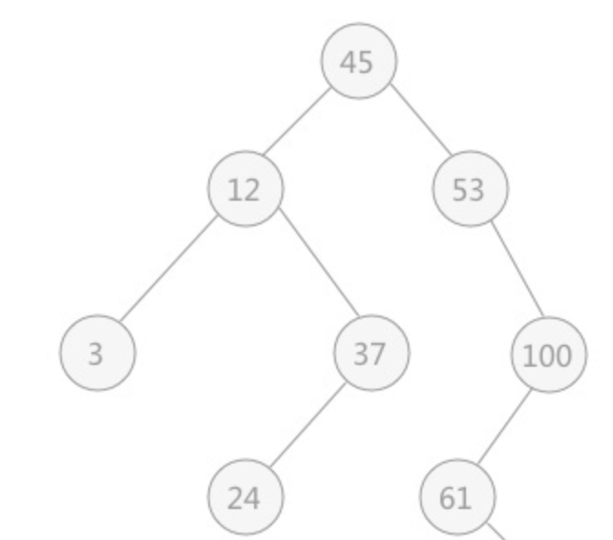
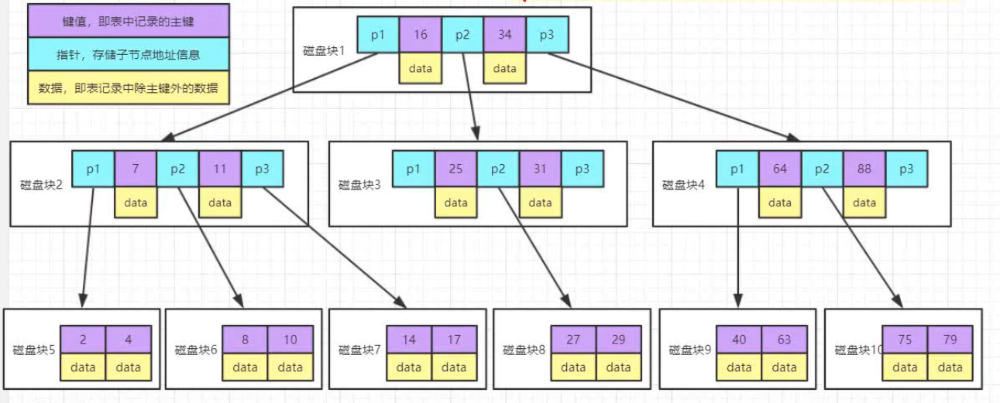
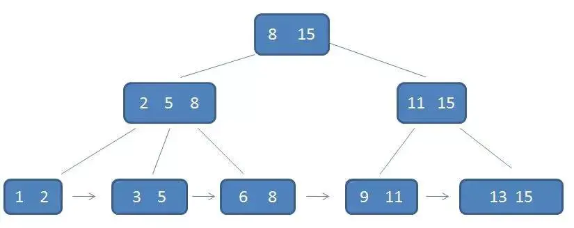

# B树

## 二叉查找树

每个节点左边节点的值都小于该节点，右边节点的值都大于该节点，没有值相等的节点，最顶端的节点被称为根节点。

## 平衡二叉树

平衡二叉树首先也是一个二叉树，需要满足二叉树的所有条件，然后有所改进，规定了左右子树的高度差不能超过1，如果插入数据导致高度差超过了1则自动进行调整，回复到平衡状态。

## B树

B树又称为多路平衡查找树，为了减少IO的次数，就要减少树的高度，但是无论二叉树还是平衡二叉树都是只有两个节点，于是B树被研发出来：

矮胖是B树的特点，它的每个节点最多包含m个节点，m称为B树的阶，如图就是一个3阶的B树

## B+树

一个节点有键值、指针和数据三部分，而我们读取数据时只有最后读到我们想要的数据，才会将其取出。B+树改进了B树, 让内结点只作索引使用, 去掉了其中指向data record的指针, 使得每个结点中能够存放更多的键值, 因此能有更大的出度. 这有什么用? 这样就意味着存放同样多的key, 树的层高能进一步被压缩, 使得检索的时间更短。叶子节点两两之间相互连接，顺序查询性能更高。

而父节点的键值会作为子节点的最大值或最小值出现，因为只有叶子节点才可以拿到数据。

B+树的特点：

1. 有k个子树的中间节点包含有k个元素（B树中是k-1个元素），每个元素不保存数据，只用来索引，所有数据都保存在叶子节点。
2. 有的叶子结点中包含了全部元素的信息，及指向含这些元素记录的指针，且叶子结点本身依关键字的大小自小而大顺序链接。
3. 所有的中间节点元素都同时存在于子节点，在子节点元素中是最大（或最小）元素。

B+树的优势：

1. 单一节点存储更多的元素，使得查询的IO次数更少。
2. 所有查询都要查找到叶子节点，查询性能稳定。
3. 所有叶子节点形成有序链表，便于范围查询。
