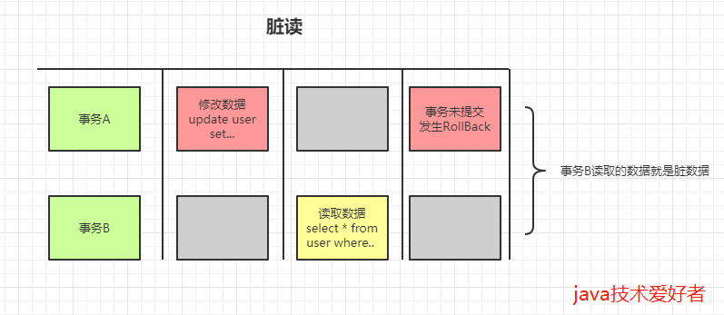
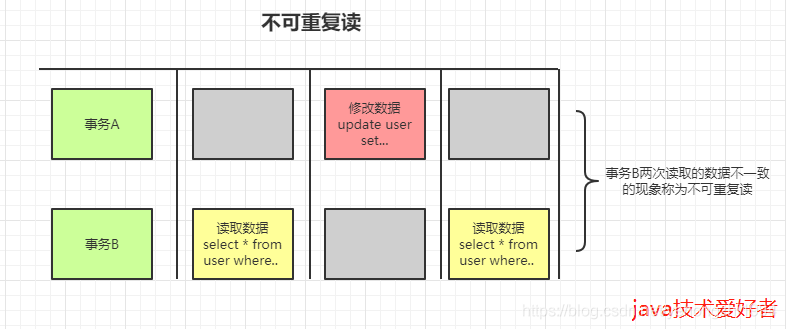
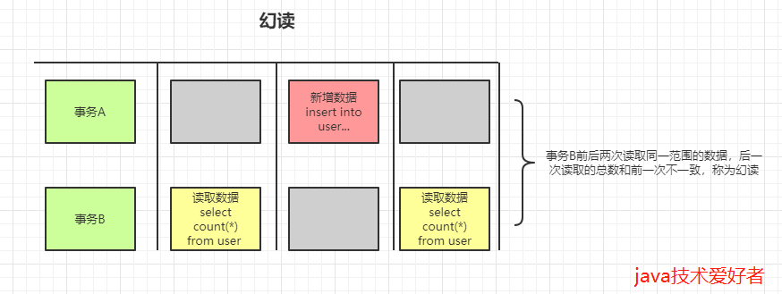

# 数据库四大特性

## **事务**

事务(Transaction)是并发控制的基本单位。所谓事务，它是一个操作序列，这些操作要么都执行，要么都不执行，它是一个不可分割的工作单位。例如，银行转帐工作：从一个帐号扣款并使另一个帐号增款，这两个操作要么都执行，要么都不执行。

## **原子性(Atomicity)**

原子性是指事务包含的所有操作要么全部成功，要么全部失败回滚，因此事务的操作如果成功就必须要完全应用到数据库，如果操作失败则不能对数据库有任何影响。

## **一致性(Consistency)**

一致性是指事务必须使数据库从一个一致性状态变换到另一个一致性状态，也就是说一个事务执行之前和执行之后都必须处于一致性状态。

拿转账来说，假设用户A和用户B两者的钱加起来一共是5000，那么不管A和B之间如何转账，转几次账，事务结束后两个用户的钱相加起来应该还得是5000，这就是事务的一致性。

## **隔离性(Isolation)**

指的是在并发环境中，当不同的事务同时操纵相同的数据时，每个事务都有各自的完整数据空间。由并发事务所做的修改必须与任何其他并发事务所做的修改隔离。事务查看数据更新时，数据所处的状态要么是另一事务修改它之前的状态，要么是另一事务修改它之后的状态， **事务不会查看到中间状态的数据** 。隔离性是当多个用户并发访问数据库时，比如操作同一张表时，数据库为每一个用户开启的事务，不能被其他事务的操作所干扰，多个并发事务之间要相互隔离。即要达到这么一种效果：对于任意两个并发的事务T1和T2，在事务T1看来，T2要么在T1开始之前就已经结束，要么在T1结束之后才开始，这样每个事务都感觉不到有其他事务在并发地执行。关于事务的隔离性数据库提供了多种隔离级别

### 隔离级别

数据库管理系统 **采用锁机制来实现事务的隔离性** 。当多个事务同时更新数据库中相同的数据时，只允许持有锁的事务能更新该数据，其他事务必须等待，直到前一个事务释放了锁，其他事务才有机会更新该数据。

#### 脏读

脏读（Dirty Reads）：所谓脏读就是对脏数据（Drity Data）的读取，而脏数据所指的就是未提交的数据。也就是说，一个事务正在对一条记录做修改，在这个事务完成并提交之前，这条数据是处于待定状态的（可能提交也可能回滚），这时，第二个事务来读取这条没有提交的数据，并据此做进一步的处理，就会产生未提交的数据依赖关系。这种现象被称为脏读。

#### 不可重复读

不可重复读（Non-Repeatable Reads）：一个事务先后读取同一条记录，但两次读取的数据不同，我们称之为不可重复读。也就是说，这个事务在两次读取之间该数据被其它事务所修改。

#### 幻读

幻读（Phantom Reads）：一个事务按相同的查询条件重新读取以前检索过的数据，却发现其他事务插入了满足其查询条件的新数据，这种现象就称为幻读。

幻读和不可重复读有些类似，但是幻读强调的是集合的增减，而不是单条数据的更新。

## **持久性(Durability)**

持久性是指一个事务一旦被提交了，那么对数据库中的数据的改变就是永久性的，即便是在数据库系统遇到故障的情况下也不会丢失提交事务的操作。

## 日志

事务的（ACID）特性是由关系数据库管理系统（RDBMS，数据库系统）来实现的。数据库管理系统 **采用日志来保证事务的原子性、一致性和持久性** 。日志记录了事务对数据库所做的更新，如果某个事务在执行过程中发生错误，就可以根据日志，撤销事务对数据库已做的更新，使数据库退回到执行事务前的初始状态。
