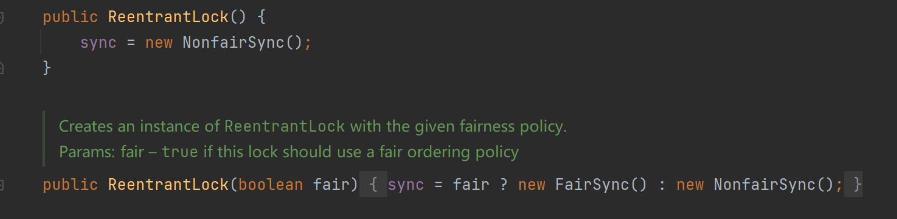

# Synchronized

## 线程同步

Synchronized是一个关键字

在多线程编程时，一些敏感数据不允许被多个线程同时访问，保证数据在任何时刻，最多只有一个线程访问，以保证数据完整性。

## 同步方法-Synchronized

1. 同步代码块
   ```java
    synchronized（对象）{   //得到对象的锁，才能操作同步代码块
        //需要同步的代码块
    }
   ```
2. synchronized还可以放在方法声明中
   ```java
    public synchronized void m（）{
        //同步的代码块
    }
   ```

# Lock

lock锁是一个接口，实现类ReentrantLock的默认构造方法是是非公平锁形式



## 公平锁和非公平锁

公平锁：多个线程按照申请锁的顺序去获得锁，线程会直接进入队列去排队，永远都是队列的第一位才能得到锁。

* 优点：所有的线程都能得到资源，不会饿死在队列中。
* 缺点：吞吐量会下降很多，队列里面除了第一个线程，其他的线程都会阻塞，cpu唤醒阻塞线程的开销会很大。

非公平锁：多个线程去获取锁的时候，会直接去尝试获取，获取不到，再去进入等待队列，如果能获取到，就直接获取到锁。

* 优点：可以减少CPU唤醒线程的开销，整体的吞吐效率会高点，CPU也不必取唤醒所有线程，会减少唤起线程的数量。
* 缺点：你们可能也发现了，这样可能导致队列中间的线程一直获取不到锁或者长时间获取不到锁，导致饿死。

Lock锁流程：

1. new ReentrantLock()
2. lock.lock();加锁
3. lock.unlock();解锁

# Synchronized和lock的区别

| 类别                 | Synchronizedcol                                                | lock                                                                                                                                                                   |
| :------------------- | -------------------------------------------------------------- | ---------------------------------------------------------------------------------------------------------------------------------------------------------------------- |
| 本质                 | 关键字                                                         | 接口                                                                                                                                                                   |
| 发生异常时，锁的释放 | synchronized在发生异常时候会自动释放占有的锁，因此不会出现死锁 | 而lock发生异常时候，不会主动释放占有的锁，必须手动unlock来释放锁，可能引起死锁的发生。（所以最好将同步代码块用try catch包起来，finally中写入unlock，避免死锁的发生。） |
| 是否响应中断         | synchronized只能等待锁的释放，不能响应中断                     | lock等待锁过程中可以用interrupt来中断等待                                                                                                                              |
| 是否知道获取锁       | 不能                                                           | Lock可以通过trylock来知道有没有获取锁                                                                                                                                  |
| 锁的类型             | 可重入 不可中断 非公平                                         | 可重入 可判断 可公平                                                                                                                                                   |
| 性能                 | 少量同步                                                       | 大量同步                                                                                                                                                               |


**相同点：**

* 都是可重入锁
* 都保证了可见性和互斥性
* 都可以用于控制多线程对共享对象的访问
